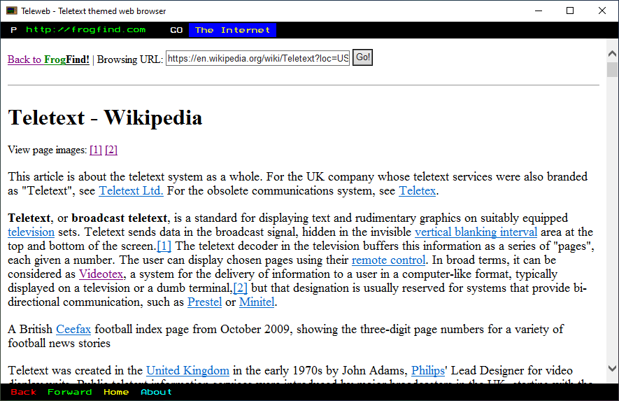

# Teleweb
Teletext themed web browser built on Visual Basic 2010  
(Fairly limited, but is still functional.)  

# Websites that might not render properly
* Google
* Wikipedia
* Most websites that heavily use CSS
# Screenshots

